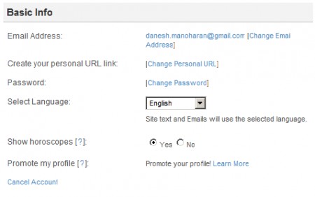

Deleted my [Friendster][1] account today. I have no need for it anymore as most of my social networking activity happen on [Facebook][2] for me now.

Here' s how to delete your account if you choose to.

1. Log in to Friendster.

2. Go to the settings page. The "settings" link's on the top right.

3. In the Basic Info section, look for the "cancel account" link.

4. Complete the "Cancellation Form" and proceed.

5. Wait for the confirmation dialog. If you see it then your account has been removed.

\*\*Remember\*\*

There is no return beyond the point of deletion so make sure to consider real hard before deleting your account.

 [1]: http://friendster.com
 [2]: http://facebook.com
 [3]: /wp-content/uploads/2009/10/Friendster-Home_1256096003821.png)
 [4]: ../wp-content/uploads/2009/10/Friendster-Account-Settings_1256096041210.png)
 [5]: /wp-content/uploads/2009/10/Friendster-Cancel-Account_1256096096761.png)
 [6]: ../wp-content/uploads/2009/10/Friendster-Cancel-Account_1256096399647.png)