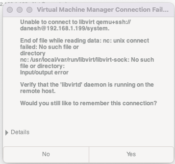
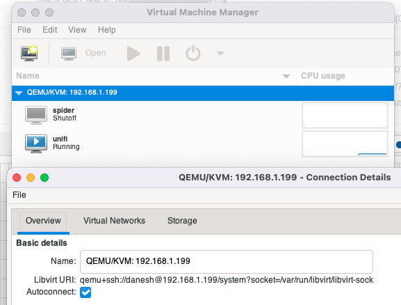

virt-manager installed using homebrew defaults to `/usr/local/var/run/libvirt/libvirt-sock` for the libvirtd socket location on remote hosts. This is not a valid location and the connection fails.

The work around is to use a custom connection string and pass the correct socket location. e.g.

`qemu+ssh://<user name>@<host address>/system?socket=/var/run/libvirt/libvirt-sock`

