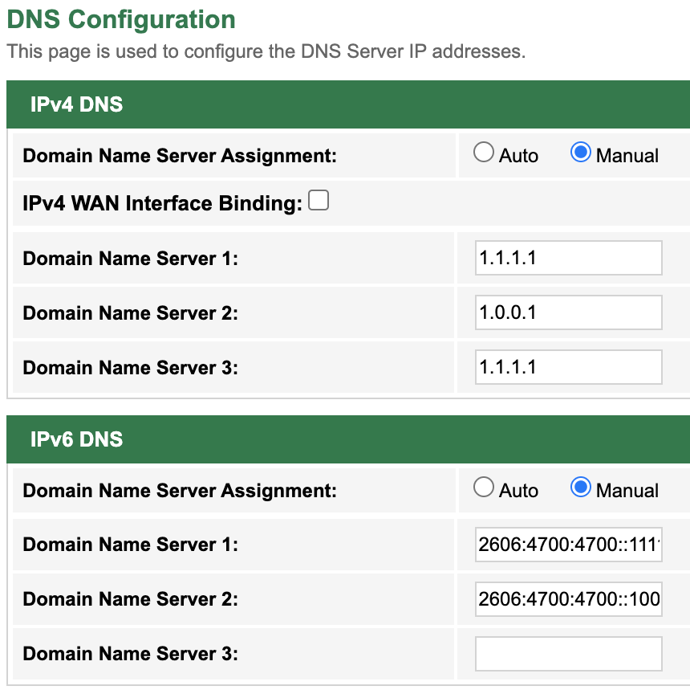

The factory configuration on the TM Unifi Netis DL4480V1 modem/router defaults to TM's DNS servers. I prefer to use custom external DNS servers instead, to bypass any potential censorship at the ISP DNS level.

I normally have PiHole running on a RPi sitting around for this purpose but can't get my hands on one in Malaysia at MSRP.

Follow the steps below to change the default DNS servers to Cloudflare's DNS servers.



### Cloudflare's DNS servers

IPv4

```shell
Primary: 1.1.1.1
Secondary: 1.0.0.1
```

IPv6

```shell
2606:4700:4700::1111
2606:4700:4700::1001
```

### Steps

1. Log on to the router at `192.168.1.1`. http://192.168.1.1/
2. Login is `tmadmin` and password is `Adm@[last 4 characcter in the mac address]`
3. Navigate to "Service" -> "DNS Server" page.
4. Change "Domain Name Server Assignment" to "Manual".
5. Update the Domain Name Server [1..3] fields with the new DNS servers.
6. Navigate to "Service" -> "DHCP" page.
7. Update "DNS Option" tp "Use DNS Relay".
8. Apply your changes and reboot the router.
